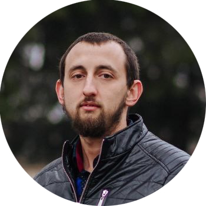

# Andrii Kovpak [Experienced Full Stack Developer | FE | BE | Mobile]

**[React, Vue, Angular, Bootstrap, TailwindCSS, Flutter, NestJs, Loopback, Express, Laravel]**

Armed with expertise in FE and BE development, I orchestrate seamless interactions between users and servers. Whether it's creating a cool UI or designing a complex DB, I treat each layer of the stack with precision and finesse.

Software development is about solving real problems, not just writing code. I'm used to debugging and fixing my code until it's at peak performance while maintaining a clean and maintainable codebase.

Technology never stands still, and neither do I. I'm always trying to stay ahead of the curve with the latest trends, frameworks and tools. This insatiable curiosity fuels a passion for lifelong learning, allowing me to quickly adapt to new technologies and best practices.

**Let's create a great tomorrow together:**

If you have an exciting project or a challenge to tackle, we want to join forces. Together we can build the web of tomorrow that will leave a lasting mark on the world. Let's connect and start the journey of infinite possibilities!
